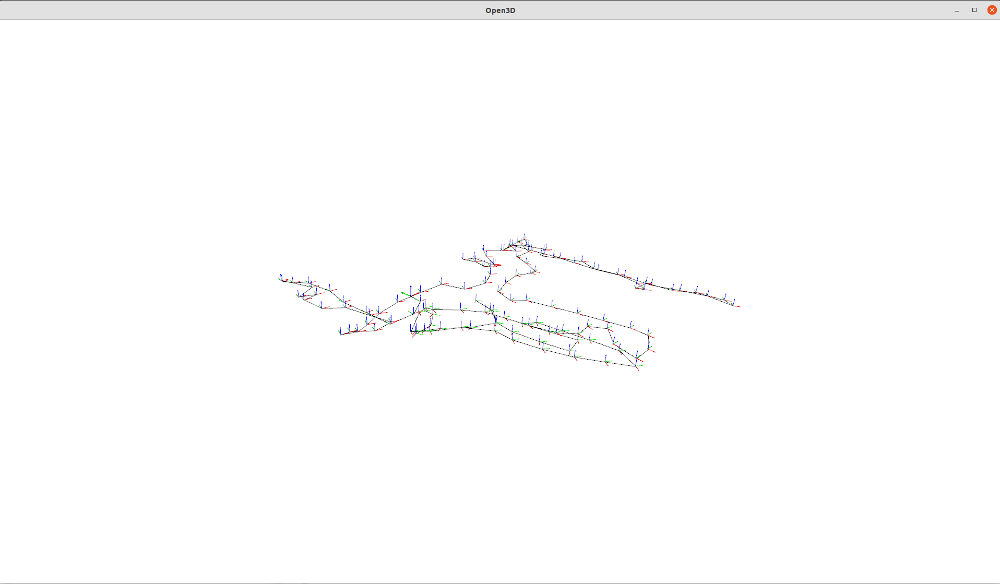

# Reading cartographer's pbstream files

Used to read and dump information contained in pbstream files generated by cartographer.
Uses the protobuf definitions from Cartographer 2.0.0.

## Usage

### Print info

    python src/main.py info --inputfile trajectory.pbstream

Example output:

```
Info about: ./b3-2016-04-05-14-14-00.bag.pbstream
Serialization Header-Format Version: 2
Fieldname                            	#Entries
Field: pose_graph                    	     1 entry
Field: all_trajectory_builder_options	     1 entry
Field: submap                        	   136 entries
Field: node                          	 21679 entries
Field: trajectory_data               	     1 entry
Field: imu_data                      	305059 entries

Process finished with exit code 0
```


### Print trajectory


    python src/main.py trajectory --inputfile trajectory.pbstream

Example output:
```
node {
  timestamp: 638312009194944015
  pose {
    translation {
      x: 0.016291482188475023
      y: -0.04282640925437251
    }
    rotation {
      x: -4.020482286351013e-05
      y: 6.823308684472771e-05
      z: 0.007547810991858684
      w: 0.999971511732734
    }
  }
}
node {
  timestamp: 638312009245120663
  pose {
    translation {
      x: 0.02964719848852663
      y: -0.048001737613742074
    }
    rotation {
      x: -0.0011754380012874135
      y: 0.00123397455994794
      z: 0.009252885321840362
      w: 0.9999557389032334
    }
  }
  node_index: 1
}
node {
  timestamp: 638312009295623075
  pose {
    translation {
      x: 0.03618836244390297
      y: -0.06800972995952795
    }
    rotation {
      x: -0.0013192705615905048
      y: 0.0013112960072545145
      z: 0.011307111708631084
      w: 0.9999343424709322
    }
  }
  node_index: 2
}
...
```

### Plot trajectory

    python src/main.py plot --inputfile trajectory.pbstream

Example output:


